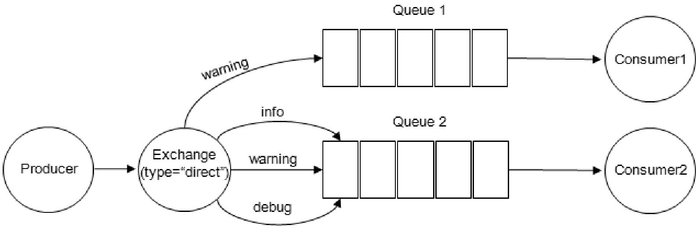

## RabbitMQ常用的交换器类型

RabbitMQ常用的交换器类型有fanout、direct、topic、headers这四种。AMQP协议里还提到另外两种类型：System和自定义，这里不予描述。对于这四种类型下面一一阐述。

### fanout：

它会把所有发送到该交换器的消息路由到所有与该交换器绑定的队列中。

### direct：

direct类型的交换器路由规则就是把消息路由到那些BindingKey和RoutingKey完全匹配的队列中。如下图：

交换器的类型为direct，如果我们发送一条消息，并在发送消息的时候设置路由键为“warning”，则消息会路由到Queue1和Queue2，如果在发送消息的时候设置路由键为“info”或者“debug”，消息只会路由到Queue2。如果以其他的路由键发送消息，则消息不会路由到这两个队列中。

### topic：

topic类型的交换器在匹配规则上进行了扩展，它与direct类型的交换器相似，也是将消息路由到BindingKey和RoutingKey相匹配的队列中，但这里的匹配规则有些不同，约定如下：

- RoutingKey为一个点号`"."`分隔的字符串（被点号`"."`分隔开的每一段独立的字符串称为一个单词，如："com.rabbitmq.client"、“com.hidden.client”
- BindingKey和RoutingKey一样也是点号`"."`分隔的字符串；
- BindingKey中可以存在两种特殊字符串`"*"`和`"#"`，用于做模糊匹配，其中`"*"`用于匹配一个单词，`"#"`用于匹配多规格单词（可以是零个）。

以下图为例：

- 路由键为"com.rabbitmq.client"的消息会同时路由到Queue1和Queue2；
- 路由键为"com.hidden.client"的消息只会路由到Queue2中；
- 路由键为"com.hidden.demo"的消息只会路由到Queue2中；
- 路由键为"java.rabbitmq.demo"的消息只会路由到Queue1中；
- 路由键为"java.util.concurrent"的消息将会被丢弃或者返回给生产者（需要设置mandatory参数），因为它没有匹配任何路由键。

### headers：

headers类型的交换器不依赖于路由键的匹配规则来路由消息，而是根据发送的消息内容中的headers属性进行匹配。在绑定队列和交换器时制定一组键值对，当发送消息到交换器时，RabbitMQ会获取到该消息的headers（也是一个键值对的形式），对比其中的键值对是否完全匹配队列和交换器绑定时指定的键值对，如果完全匹配则消息会路由到该队列，否则不会路由到该队列。headers类型的交换器性能会很差，而且也不实用，基本上不会看到它的存在。