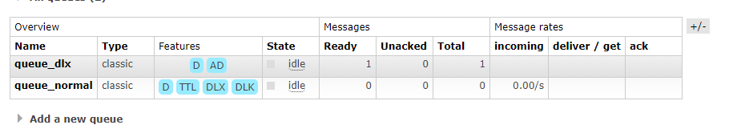
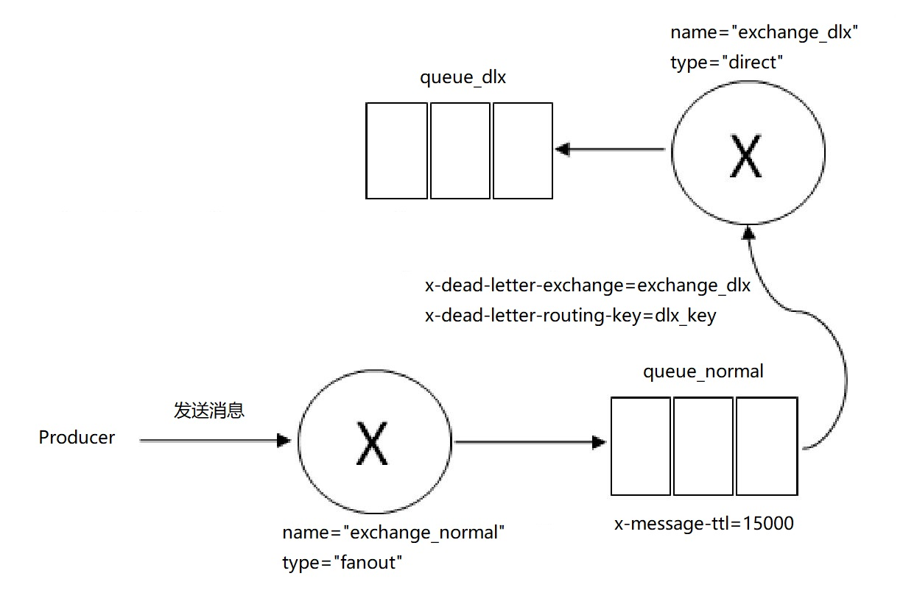

### 死信队列

DLX，全称为Dead-Letter-Exchange，可以称之为死信交换器，也有人称之为死信邮箱。当消息在一个队列中变成死信（dead message）之后，它能被重新被发送到另一个交换器中，这个交换器就是DLX，绑定DLX的队列就称之为死信队列。

消息变成死信一般是由于以下几种情况：

- 消息被拒绝（Basic.Reject/Basic.Nack），并且设置requeue参数为false；
- 消息过期；
- 队列达到最大长度。

DLX也是一个正常的交换器，和一般的交换器没有区别，它能在任何的队列上被指定，实际上就是设置某个队列的属性。当这个队列中存在死信时，RabbitMQ就会自动地将这个消息重新发布到设置的DLX上去，进而被路由到另一个队列，即死信队列。可以监听这个队列中的消息以进行相应的处理，这个特性与将消息的TTL设置为0配合使用可以弥补immediate参数的功能。

代码如下:

```php
<?php
require_once __DIR__ . '/../vendor/autoload.php';

use PhpAmqpLib\Connection\AMQPStreamConnection;
use PhpAmqpLib\Message\AMQPMessage;
use PhpAmqpLib\Wire\AMQPTable;

/**
 * 死信队列
 */
try{
    $connection = new AMQPStreamConnection('127.0.0.1', 5672, 'doubi', '123456');
	$channel = $connection->channel();
    
	// 创建普通交换机
	$channel->exchange_declare('exchange_normal', 'fanout');

	// 死信交换机
	$channel->exchange_declare('exchange_dlx', 'direct');

	// 创建普通队列，并设置TTL和DLX
	$channel->queue_declare(
	    'queue_normal',
	    false,
	    true,
	    false,
	    false,
	    false,
	    new AMQPTable([
	        'x-message-ttl'=>15000,	//ms
	        'x-dead-letter-exchange'=>'exchange_dlx',
	        'x-dead-letter-routing-key'=>'dlx_key'
	    ])
	);

	// 绑定
	$channel->queue_bind('queue_normal', 'exchange_normal', 'normal_key');

	// 死信队列
	$channel->queue_declare('queue_dlx');

	// 绑定死信队列
	$channel->queue_bind('queue_dlx', 'exchange_dlx', 'dlx_key');

	//向普通队列发送消息
	$message = new AMQPMessage('hello world');
	$channel->basic_publish($message,'exchange_normal', 'normal_key', true);

	// $channel->close();
	// $connection->close();

}catch(\Exception $e){
	echo "异常信息".$e->getMessage();
}

```


这里创建了两个交换器exchange_normal和exchange_dlx，分别绑定两个队列queue_normal 和queue_dlx。

由Web管理页面（下图）可以看出，两个队列都被标记了“D”，这个是durable的缩写，即设置了队列持久化。queue.normal这个队列还配置了TTL、DLX和DLK，其中DLK指的是x-dead-letter-routing-key这个属性。



参考图下图，生产者首先发送一条携带路由键为“rk”的消息，然后经过交换器exchange.normal顺利地存储到队列queue.normal中。由于队列queue_normal设置了过期时间为15s，在这15s内没有消费者消费这条消息，那么判定这条消息为过期。由于设置了DLX，过期之时，消息被丢给交换器exchange_dlx中，这时找到与exchange_dlx匹配的队列queue_dlx，最后消息被存储在queue_dlx这个死信队列中。



对于RabbitMQ来说，DLX是一个非常有用的特性。它可以处理异常情况下，消息不能够被消费者正确消费（消费者调用了Basic.Nack或者Basic.Reject）而被置入死信队列中的情况，后续分析程序可以通过消费这个死信队列中的内容来分析当时所遇到的异常情况，进而可以改善和优化系统。DLX配合TTL使用还可以实现延迟队列的功能。


### 延迟队列

延迟队列存储的对象是对应的延迟消息，所谓“延迟消息”是指当消息被发送以后，并不想让消费者立刻拿到消息，而是等待特定时间后，消费者才能拿到这个消息进行消费。

延迟队列的使用场景有很多，如：

- 在订单系统中，一个用户下单之后通常有30分钟的时间进行支付，如果30分钟之内没有支付成功，那么这个订单将进行异常处理，这时就可以使用延迟队列来处理这些订单了。
- 用户希望通过手机远程遥控家里的智能设备在指定的时间进行工作。这时候就可以将用户指令发送到延迟队列，当指令设定的时间到了再将指令推送到智能设备。

在AMQP协议中，或者RabbitMQ本身没有直接支持延迟队列的功能，但是可以通过前面所介绍的DLX和TTL模拟出延迟队列的功能。

